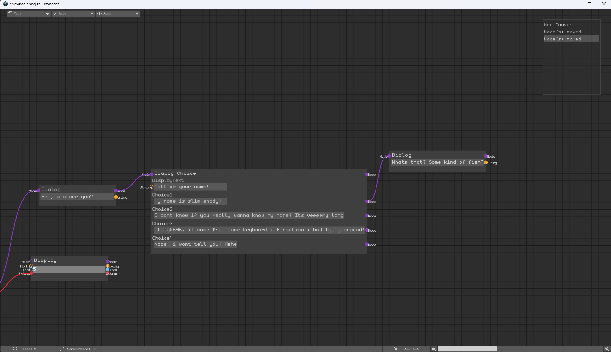

# raynodes

`raynodes` is a standalone 2D node editor made using [raylib](https://github.com/raysan5/raylib) and [raygui](https://github.com/raysan5/raygui) with a focus
extensibility. It aims to be an attractive tool for any node based task, and supports being integrated into
bigger projects like games, editors...
In many cases it comes close to being a node-editor SDK of sorts.

A small showcase of its major features:

- **Clean**, **modularized** and **documented** source code!
- Extensive and easy-to-use **node and component** interface allowing for endless customization!
- Custom filetype optimized for **low export size**
- **Fast and optimized** import header included for working with project exports!
- Supports both **Windows and Linux** (and possibly macOS)
- **Plugin interface** and capabilities
- **Unit testing** of critical parts (importing, persistence...)
- Fully-fledged **User created** nodes in-editor without touching the source code!
- **Modern code base** using many C++20 and above

For more infos on the design choices go to [Software Design](#Software-Design)  
For more information on how to use the editor look at the [raynodes-wiki](https://github.com/gk646/raynodes/wiki).  
The other dependencies are [cxstructs](https://github.com/gk646/cxstructs), [tinyfiledialogs](https://sourceforge.net/projects/tinyfiledialogs/) for file dialogs and [catch2](https://github.com/catchorg/Catch2) for testing.



**1.** [Installation](#Installation)  
**2.** [Editor Features](#Editor-Features)   
**3.** [Components!](#Custom-Nodes)  
**4.** [Plugins](#Plugins)  
**5.** [Nodes!](#Custom-Nodes)  
**6.** [Software Design](#Software-Design)

## Installation

### For Users

Just download the .zip for your operating system  from the most recent release in the [release page](https://github.com/gk646/raynodes/releases).
Unzip and start the executable! Have fun using `raynodes`.

### For Developers

This project uses CMake as buildsystem!

To build the project locally you just need to do 4 simple steps:

1. Clone this git repository
2. Create a new directory inside the clone repository (e.g. cmake-build-debug)
3. Configure the build from inside the build directory with `cmake ..`
4. Build the project from inside the build directory with `make ..`

All external dependencies are included in the source!
This model is chosen based on their combined low size (only **14mb**) and the provided simplicity for sharing and integrated testing.

## Editor Features:

### Command Line interface

`raynodes` can be passed a path which it will try to open over the commandline.  
Files starting with `.` (dot) will be interpreted as relative paths:  
`./raynodes.exe ./MyRelativePathFile.rn`  
Else it will be interpreted as absolute path:  
`./raynodes.exe C:\Users\Me\Documents\MyAbsoluteFile.rn`


**On Windows you can also set it as the default executable for ".rn" files, then double click to open any such file!**

### Controls

`raynodes` has supports all common shortcuts. For a comprehensive list check out
the [shortcuts](https://github.com/gk646/raynodes/wiki/Controls) page in the wiki!.

### User Interface

The user interface takes inspiration from other editors like paint.net. For a comprehensive list checkout
the [user-interface](https://github.com/gk646/raynodes/wiki/User-Interface) page of the wiki!

### User Defined Templates 

`raynodes` gives you the ability to create your own nodes without even interacting with the source code!
Open the `Node Creator` window via the button on the left and add a new node by clicking `+Add`. For more in-depth information check out the [User-Created-Nodes](https://github.com/gk646/raynodes/wiki/User-Created-Nodes) page of the wiki!

## Custom Components!

Components are the second level of customization you can achieve. For that you can implement the Component interface
inside your own plugin. For the most part a component is a simple struct that is drawn and updated inside the node.
Inside the update function you have full write and read access to the context and design and draw complex components.

This is a glimpse at the interface but the Component.h header has a lot more and is **self documenting**! Check it out!

```cpp
  //-----------CORE-----------//
  // Necessary to copy the component
  virtual Component* clone() = 0;
  // IMPORTANT: Only called when its bounds are visible on the screen!
  virtual void draw(EditorContext& ec, Node& parent) = 0;
  // Guaranteed to be called once per tick (on the main thread) (not just when focused)
  virtual void update(EditorContext& ec, Node& parent) = 0;
  // Use the symmetric helpers : io_save(file,myFloat)...
  virtual void save(FILE* file) {}
  //Use the symmetric helpers : io_load(file,myFloat)...
  virtual void load(FILE* file) {}

  //-----------EVENTS-----------//
  // All called once, guaranteed before update() is called
  virtual void onMouseEnter(EditorContext& ec) {}
  virtual void onMouseLeave(EditorContext& ec) {}
  virtual void onFocusGain(EditorContext& ec) {}
  virtual void onFocusLoss(EditorContext& ec) {}

  //-----------LIFE CYCLE-----------//
  // Called once at creation time after the constructor
  virtual void onCreate(EditorContext& ec, Node& parent) {}
  // IMPORTANT: Only called once when the node is finally destroyed (only happens after its delete action is destroyed)
  // This may happen very delayed or even never!
  virtual void onDestruction(Node& parent) {}
  // Called whenever component is removed from the screen (delete/cut)
  virtual void onRemovedFromScreen(EditorContext& ec, Node& parent) {}
  // Called whenever component is added to the screen (paste)
  virtual void onAddedToScreen(EditorContext& ec, Node& parent) {}

  //-----------CONNECTIONS-----------//
  // Called once when a new connection is added
  virtual void onConnectionAdded(EditorContext& ec, const Connection& con) {}
  // Called once when an existing connection is removed
  virtual void onConnectionRemoved(EditorContext& ec, const Connection& con) {}
```

The interface is quite expansive and abstract allowing an implementation to react to a multitude of events.

### Loading and saving

Loading and saving its state is made easy through a supplied symmetric save format.
Just call the `io_save` which supports int, float, string and raw data(future).

This is how you save and retrieve a string:

```cpp
void TextInputField::save(FILE* file) {
cxstructs::io_save(file, buffer.c_str());
//More possible member variables:
//cxstructs::io_save(file, myFloat);
//cxstructs::io_save(file, myInt);
//cxstructs::io_save(file, myAllocatedDataPtr, mySize);
}
void TextInputField::load(FILE* file) {
cxstructs::io_load(file, buffer);
//More possible member variables
//cxstructs::io_load(file, myFloat);
//cxstructs::io_load(file, myInt);
//cxstructs::io_load(file, myAllocatedDataPtr, mySize);
}
```

## Plugins

Whenever you want to make custom components or nodes you will need to make your own plugin. `raynodes` provides an
easy-to-use plugin interface that allows defining custom components and building nodes out of them.

**When creating your plugin you have to link against the base editor (statically) and against raylib (shared).**

```cpp
struct RaynodesPluginI {
  virtual ~RaynodesPluginI() = default;
  // Called once after its been loaded
  virtual void onLoad(EditorContext& ec) {}
  // Called once at the correct time to register its components
  virtual void registerComponents(ComponentRegister& cr) {}
  // Called once at the correct time to register its nodes
  virtual void registerNodes(NodeRegister& nr) {}
};

extern "C" EXPORT RaynodesPluginI* CreatePlugin() {
  return new MyPlugin();
}
```

Implement this interface and **add the exported function to create an instance.**

### Registering Components

Components are easily registered by providing a name and its type. This works cause all Components have a similar
constructor.
After you implemented a new Component by creating a derived class in your plugin files just include its header and
register it in your plugin.

**NOTE: Components are uniquely identified by this name (naming collision will be shown when loading).**
This means it's advised to pick a namespace for your plugin (small prefix).

Syntax: `registerComponent<ComponentType>("<Component-Identifier>")`

```cpp
void BuiltIns::registerComponents(ComponentRegister& cr) {
  cr.registerComponent<MathC>("BI_MathOp");
  cr.registerComponent<DisplayC>("BI_Display");
  cr.registerComponent<SeparateXYZC>("BI_SeparateXYZ");
  cr.registerComponent<Vec3OutC>("BI_Vec3Out");
}
```

### Registering Nodes

A node is then just a container for components. The register process allows to set custom labels for each component
which helps to reference a specific component later on:

Syntax: `registerNode("<NodeName>", { {<CustomLabel>,<Component-Identifier>}, ... }`

```cpp
void BuiltIns::registerNodes(NodeRegister& nr) {
  nr.registerNode("MathOp", {{"Operation", "BI_MathOp"}});
  nr.registerNode("TextField", {{"TextField", "BI_TextOut"}});
  nr.registerNode("NumberField", {{"Number", "BI_NumberOut"}});
  nr.registerNode("SeparateXYZ", {{"Vector", "BI_SeparateXYZ"}});
  nr.registerNode("Vector 3", {{"Vector3", "BI_Vec3Out"}});
}
```

Plugins will be loaded from the `./plugins` folder relative to the executable

## Custom Nodes!

The node interface is entirely optional but can be used to gain another level of control to implement functionality.
It's mostly there to orchestrate existing components by allowing to specify an update and render tasks that runs after
all components.

```cpp
//-----------CORE-----------//
// Guaranteed to be called each tick and AFTER all components have been updated
virtual void update(EditorContext& ec) {}
// Called only when the node bounds are (partially) within the screen
virtual void draw(EditorContext& ec) {}
// Called at save time - allows you to save arbitrary, unrelated additional state data
virtual void saveState(FILE* file) const {}
// Called at load time - should be the exact same statements and order as in saveState();
virtual void loadState(FILE* file) {}

//-----------LIFE CYCLE-----------//
// Called once when the node is created and AFTER all components
virtual void onCreation(EditorContext& ec) {}
```

This interface is still quite young and will be expanded.

## Software Design

### Software General

- Prefer fixed size containers for lower level structs for better cache efficiency
    - Also helps to reduce allocations
- No global state to allow for modularity if needed (and testability...)
- Move away from providing source code extensibility in favour of in-editor extensibility
    - Project isn't centered around code interaction but in-editor interaction
- ~~2 thread model - Logic and draw thread (remove logic time overhead and memory management from draw thread)~~
    - ~~Only minimal synchronization needed (with spin lock and only in EditorContext getters and setters)~~
    - ~~Through clean code structure critical sections can easily be defined~~
- 1 Thread is enough - 2 Threads introduce code complexity
    - Logic overhead is very small
- Structure code by exporting big functions into headers

### Software Concepts

EditorContext - DataBackend

- Should just hold data and perform up to clever getter and setter tasks
    - Exceptions to this are backend tasks which have a limited scope inside the EditorContext

NodeEditor - Logic

- Will be passed a EditorContext& to operate on
- Defines logic that works on the data

### Format and Style

- General style guide [cxutil/cxtips.h](https://github.com/gk646/cxstructs/blob/master/src/cxutil/cxtips.h)
- .clang-format at root for format

### Node Editor Concepts

The main inspiration was to create an editor that just provides a basic interface that can be used to create anything
node based like:

- Blender Node Editor
- Quest Tree (for games, DialogueTree and choices)
- Basic Logic Circuit

`raynodes` is a component-centric editor meaning that most things happen in and around components. However, with the
addition custom nodes which allows for even more control you could almost call it a hybrid.

This choice of having components was made due to a number of reasons:

- Having reusable building blocks (components) throughout nodes is good
- With only a node it's not clear who handles the input and outputs
    - Now each node has its dedicated input and outputs -> might add node level connections as well
- Components can be tied to some identifier (a string here) which allows nodes to be built at runtime
    - This allows for instructions in string form on how to build a specific node -> plugins

However, this also has some drawbacks:

- A node doesn't have the functionality of all its components combined
    - It's just a container... -> this could be improved with inter-component data transfers
- Having a nested structure adds extra complexity to reading and saving

Pretty much all the drawbacks of some earlier approaches are solved by introducing custom nodes, although this adds more
complexity and needs proper implementation of inter-component data transfer.